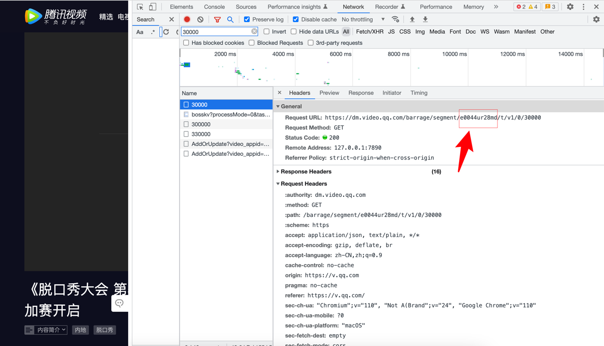

# TencentDanmu
腾讯视频弹幕爬虫

# 实现步骤
- 进入待爬取视频页面
- F12进入开发者模式
- Network中所搜30000可以看到该请求的url
- 复制url中这部分字段字段


# 运行
在这个目录下运行cmd
```
# python main.py [你想创的文件名] [url里复制的字段] [视屏的总时长(分钟)]
# 如：
python main.py 脱口秀 u0044kvn0al 20

```
